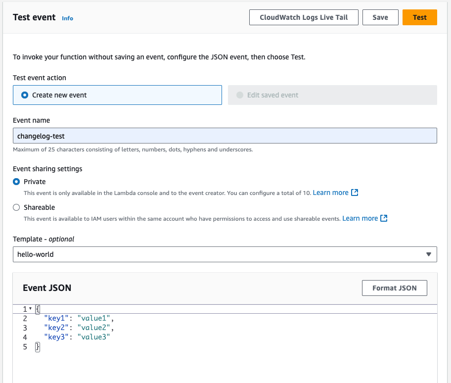

# What’s New at Shopify?

The script(s) in this repo convert https://changelog.shopify.com into an RSS feed hosted on AWS Lambda to use in Slack. The motivation behind this is that no such feed is provided by Shopify, only the Developer changelog.

### How to use

Using `node v20.x`

1. `npm install`
1. `node shopify-changelog.js`

### Lambda

 Use file `lambda-policy.json` policy at the root of the repo to create a role for your function:

```
aws iam create-role \
    --role-name <your-new-role> \
    --assume-role-policy-document file://lambda-policy.json
```

Zip your code

```
# Change into the functions directory and run:

zip -r <your-zip-file>.zip .
```

Create a new lambda function

```
aws lambda create-function \
    --function-name shopify-changelog-rss \
    --runtime nodejs20.x \
    --zip-file fileb://<your-zip-file>.zip \
    --handler shopify-changelog-lambda.handler \
    --role arn:aws:iam::xxxxxxxxxxxx:role/<your-lambda-role>
```

Remember when we add the handler we have to use the convention: `file_name.function_name` i.e. `shopify-changelog-lambda.handler`

### Test your function




### Updating the function

Whenever you make a change you will need to:

1. Zip the function
1. Run the following:

```
aws lambda update-function-code \
    --function-name shopify-changelog-rss \
    --zip-file fileb://<your-zip-file>.zip
```

### CI/CD

This repo also includes a GitHub Workflow that will update the lambda using [ GitHub's OIDC provider](https://docs.github.com/en/actions/deployment/security-hardening-your-deployments/configuring-openid-connect-in-amazon-web-services) by configuring the [role, trust, and permissions](https://docs.github.com/en/actions/deployment/security-hardening-your-deployments/configuring-openid-connect-in-amazon-web-services) in AWS IAM

---

### Author

Erik Marty <erik@themazegroup.com>
